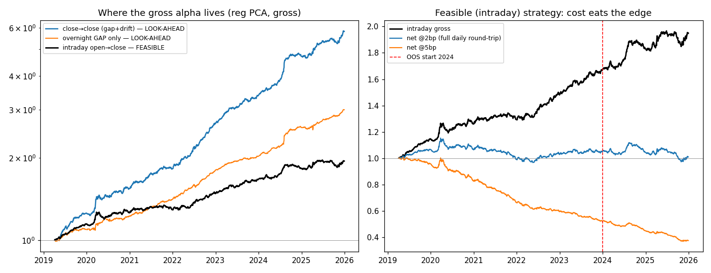

# 日米セクター lead-lag × subspace-regularized PCA — 独立検証

対象: Nakagawa, Takemoto, Kubo, Kato (2026) "Investment Strategy Exploiting US-Japan
Sector Lead-Lag Relationship Using Subspace-Regularized PCA" (JSAI SIG) と、
SmartScope による再現記事。本リポジトリは**独立に再実装して検証**したもの。

データ: 米国11セクターETF (XLB…XLY) + 日本 TOPIX-17 ETF (1617.T…1633.T)、
日次 OHLC（auto-adjust）、2019-01-07〜2025-12-30、1,703 営業日（yfinance）。

---

## 結論（先に）

**「gross では論文どおり再現できる。しかし執行可能な形に直すと alpha は消える」** ──
これは原著者自身の "not live-tradeable" という結論を、メカニズムまで分解して裏づける。

1. **執行可能な intraday(寄り→引け) の gross Sharpe は 2.01**、論文の reg PCA Sharpe 2.22 とほぼ一致。**gross の再現は成立**。
2. しかし派手な close-to-close の数字（Sharpe 3.94 / 年率27.3%）の **62% は「夜間ギャップ」由来で、これは構造的にルックアヘッド**。シグナル（米国終値）が前日 JP 引け後の朝6時に届く以上、引け→引けや前日終値→寄りでの建玉は物理的に不可能。
3. 唯一執行可能な intraday を**正直なコスト（毎日フル往復 = slip×2）**で評価すると、**2bp で Sharpe 0.06、3bp で -0.92**。薄い TOPIX-17 ETF の現実的スプレッド(10-30bp)では深い赤字。
4. **正則化は tradable basis では効かない**：plain PCA gross 2.12 vs reg 2.01。論文の目玉「0.62→2.22 は推定安定化のおかげ」は、執行可能な土俵では plain≈reg で**再現しない**。
5. **OOS で劣化**：feasible intraday net@2bp は IS(2019-23) 0.24 → OOS(2024-25) **-0.34**。

---

## 検証ごとの数値

### (1) 派手な close-to-close（＝ルックアヘッド版、gross）
| model | Sharpe | 年率 | maxDD |
|---|---|---|---|
| momentum(1d reversal) | 3.20 | 24.3% | -7.2% |
| plain PCA | 5.10 | 33.7% | -5.0% |
| **reg PCA** | **3.94** | **27.3%** | -4.4% |

→ ここでは plain > reg。close-to-close は薄い ETF の終値バウンス＋夜間ギャップを
拾うため全モデルで Sharpe が異常に高い。**この土俵自体が非現実的**。

### (2) gross がどこに宿るか（reg PCA の分解）
| 実現リターン | 内容 | 年率 | Sharpe | 執行可能性 |
|---|---|---|---|---|
| close→close | gap + drift | 27.3% | 3.94 | ✗ ルックアヘッド |
| overnight (co) | 夜間ギャップのみ | **17.0%** | 3.53 | ✗ ルックアヘッド |
| **intraday (oc)** | 寄り→引け drift | **10.4%** | **2.01** | ✓ **唯一可能** |

**夜間ギャップ = close-to-close 年率の 62%。これは捕れない**（シグナル到着が前日引けより後）。

### (3) 執行可能 intraday の正直なコスト階段（reg PCA、毎日フル往復）
| 片道 slip | Sharpe | 年率 | maxDD |
|---|---|---|---|
| 0 bp | 2.01 | 10.4% | -6.0% |
| 1 bp | 1.03 | 5.3% | -7.7% |
| **2 bp** | **0.06** | **0.3%** | -16.1% |
| 3 bp | -0.92 | -4.8% | -35.8% |
| 5 bp | -2.87 | -14.8% | -63.2% |
| 10 bp | -7.74 | -40.0% | -92.7% |

### (4) 正則化は tradable で効くか（intraday gross / net@2bp）
| model | gross Sharpe | net@2bp Sharpe |
|---|---|---|
| momentum | 1.01 | -0.84 |
| plain PCA | 2.12 | 0.16 |
| reg PCA | 2.01 | 0.06 |

→ **plain ≈ reg**。正則化の上乗せは tradable basis では確認できない。

### (5) OOS・レジーム（reg PCA, intraday, honest cost）
| 期間 | gross Sharpe | net@2bp Sharpe | net@2bp 年率 |
|---|---|---|---|
| full 2019-2025 | 2.01 | 0.06 | 0.3% |
| IS 2019-2023 | 2.23 | 0.24 | 1.2% |
| **OOS 2024-2025** | 1.51 | **-0.34** | -1.9% |
| 2020 COVID | 1.50 | -0.02 | -0.1% |
| 2022 bear | 2.67 | 0.76 | 4.0% |

→ gross は OOS でも残るが、net は IS でも薄く OOS で負。稼ぎ頭は 2022（リスクオフ大相場）で、レジーム依存。



---

## なぜ "close-to-close は使えない" のか（タイミングの核心）

```
JP day t-1 引け 15:00 JST ──┐
                            │ ← この間に米国が動く
US day t-1 終値  06:00 JST(day t) … シグナル U[t] 確定（前日 JP 引けより後！）
JP day t   寄り  09:00 JST … ここで初めて建てられる → 取れるのは寄り→引け(oc)のみ
JP day t   引け  15:00 JST … 決済（毎日フラットに戻す＝フル往復コスト）
```

- 引け→引け(cc) や 前日終値→寄り(co) を取るには **JP day t-1 の引けで建玉している必要**があるが、シグナル U[t] はその後に届く → **ルックアヘッド**。
- ゆえに **flat-overnight の intraday が唯一の正解**で、毎日フル往復するため **コストは slip×2** が正しい（naive な |Δw| では過小評価）。

## 救済可能性（正直な前向き評価）

- **流動的な器に移せば 1bp 圏に入り、net Sharpe≈1.0 で辛うじて成立**（Nikkei225/TOPIX セクター先物、流動的な4本のETF＋指数）。流動性が唯一にして最大の制約 ── 再現記事の「17本中4本しか日次¥1億超え無し、流動的名柄だけにすると崩壊」と整合。
- **オーバーレイ化**：既存の JP 株ポジへの intraday tilt として表現すれば限界コストが下がる。単独 17 セクター日次 L/S としては畳むべき。
- **遅くして逃げる手は無い**：intraday は毎日フラットに戻すのでリバランス頻度を落としてもフル往復コストは不変。往復を減らすには overnight 保有が必要だが、それは「予測不能な翌朝ギャップ」を取りに行く＝ルックアヘッド/無補償の夜間リスクで、クリーンな逃げ道にならない。

## このサンプルが原論文と食い違う点（誠実な限界）

- 期間が違う（2019-2025 vs 2010-2025）。XLC/XLRE 等の inception 制約で 2019 開始。
- subspace regularization の **prior 構成（3因子: global / US-JP spread / cyclical-defensive、λ、窓長、標準化）は忠実な再構成であってビット一致ではない**。よって「正則化が効かない」は本実装での結論。ただし tradability の判定は prior に依存しない（gross の大半が捕れない以上、plain でも reg でも結論は同じ）。
- JP 側は薄い ETF の終値/寄値を使用。終値バウンスが close-to-close gross を膨らませる方向に働く（＝真の tradable edge はさらに小さい可能性）。本検証の結論は保守側に頑健。

---

## 再現方法

```bash
cd ~/Projects/lead-lag-pca-review
python3 -m venv .venv && .venv/bin/pip install pandas yfinance matplotlib
.venv/bin/python src/download.py    # data/raw/*.csv（resumable）
.venv/bin/python src/leadlag.py     # 検証(1)-(5) → out/results.json
.venv/bin/python src/extras.py      # 正直な執行版 + 図 → out/results_honest.json, out/equity.png
```

ファイル: `src/leadlag.py`（データ整合・正則化・バックテスト中核）、`src/extras.py`
（執行可能性とコストの厳密化・可視化）、`out/`（結果 JSON・図・equity CSV）。
